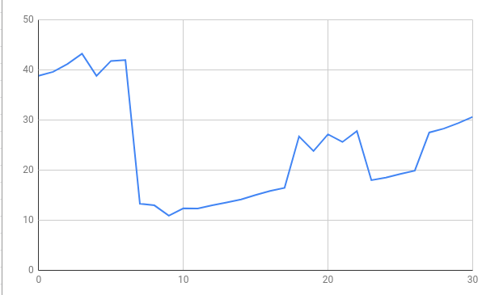

# Practical 1: Analysis of Algorithms

**Background**

There used to be an attitude that still persists today that as long as your code runs and gives the correct output,
nothing else matters. In the past if your code ran rather slowly the easy solution was to add more processing power.
Ultimately it comes down to which solution (building a better algorithm or adding more computational resources) is the
best option given the requirements of your project. If you just need to make something work for a small scale project
then focusing too much on optimizing your algorithm is not worthwhile. 

However, in a world where algorithms increasingly need to perform effectively with endless amounts of data or on limited
hardware, the ability to measure and monitor the performance of alternative algorithmic solutions becomes a very
attractive skill. And if you want to work for a top computer company (i.e. Facebook, Google, Tesla) then this is a
prerequisite skill. 

**What am I doing today?**

Today’s practical focuses on 3 things: 
- Counting basic instructions of programs
- Translating a pseudocode multiplication program in to Java
- Timing the clock performance of a program

## 1. Algorithms for Multiplication

Here is the calculation of 68*13 using the **Russian Peasant’s algorithm**

| Half | Double  |
|------|---------|
| 68   | ~~13~~  |
| 34   | ~~26~~  |
| 17   | 52      |
| 8    | ~~104~~ |
| 4    | ~~208~~ |
| 2    | ~~416~~ |
| 1    | 832     |
**Total:** 832 + 52 = 884

## 2. Counting Instructions

When analysing the performance of an algorithm we can assign a fixed and equivalent amount of time to the following operations: 
- Assigning a value to a variable
- Calling a method
- Performing an arithmetic operation
- Comparing two numbers
- Indexing into an array
- Following an object reference
- Returning from a method

__**Exercise**__

Count the instructions below in the psuedocode algorithm below and add them up to see how this algorithm performs. 

| arrayMax function               | Finds the biggest integer in an array |
|---------------------------------|---------------------------------------|
| Input: an array A of N integers |                                       |
| Output: maximum element of A    |                                       |
| arrayMax(A, n) {                |                                       |
| currentMax = A\[0\]             | 1                                     |
| For (i=0; i < A.length; i++){   | 1 + 2(n+1)                            |
| If (A\[i\] > currentMax) then   | 2n                                    |
| currentMax = A\[i\]             | 2n (worst case)                       |
| }                               |                                       |
| Return currentMax               | 1                                     |
| End function                    |                                       |
|                                 |                                       |
| Total: T(N)                     | 6N + 5                                |

## 3. Implementing the Russian Peasant’s algorithm in Java (using ints/ longs) and verify its correctness. 

You can find the implementation in
[ie.davidloftus.algorithms.RussianPeasant](../src/main/java/ie/davidloftus/algorithms/RussianPeasant.java)

## 4. Time the performance of the algorithm with various input numbers and plot the results

| 0      | 1     | 2      | 3      | 4      | 5      | 6      | 7      | 8      | 9      | 10     | 11     | 12     | 13     | 14    | 15     | 16    | 17     | 18     | 19     | 20     | 21     | 22     | 23     | 24     | 25     | 26     | 27    | 28     | 29     | 30     |
|--------|-------|--------|--------|--------|--------|--------|--------|--------|--------|--------|--------|--------|--------|-------|--------|-------|--------|--------|--------|--------|--------|--------|--------|--------|--------|--------|-------|--------|--------|--------|
| 38.831 | 39.62 | 41.185 | 43.238 | 38.817 | 41.799 | 41.967 | 13.305 | 12.969 | 10.895 | 12.369 | 12.348 | 12.983 | 13.556 | 14.15 | 15.037 | 15.84 | 16.468 | 26.721 | 23.815 | 27.147 | 25.617 | 27.782 | 17.991 | 18.508 | 19.227 | 19.884 | 27.51 | 28.285 | 29.368 | 30.618 |

