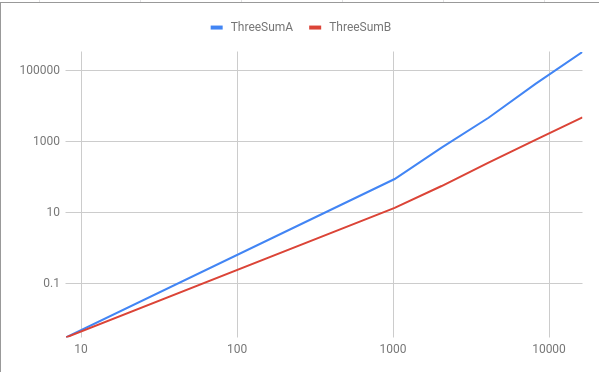

# Practical 2: Complexity Analysis

### Order of growth classifications

The following are some of the common complexity functions you will encounter:
- **Constant: O(k), for example O(1):** independent of the size of the input n
- **Logarithmic: O(log n):** Always increases, but at a slower rate as n increases. Typically found where the algorithm
    can systematically ignore fractions of the input.
- **Linear: O(n):** as n increases, run time increases in proportion
- **Linearithmic (n log(n)):** Combination of O(n) and O(log n)
- **Quadratic: Θ(n^2):** As n doubles, run-time quadruples. • However, it is still polynomial, which we consider to be
 good.
- **Polynomial: Θ(n^k)**
- **Exponential: Θ(k^n)**: This class is pretty much as bad as it gets. Can be used only for small values of n in
 practice.

### Exercise 1: Complete these sentences:

1. Algorithms with time complexities such as n and 100n are called **linear** algorithms.
2. Algorithms with time complexities such as n^2 are called quadratic-time algorithms (True or False). **True**
3. Any quadratic-time algorithm is eventually more efficient than any linear-time algorithm (True or False). **False**
4. Functions such as 5n^2 and 5n^2 +100 are called **quadratic** functions.

### Exercise 2: Order of Growth Classifications
Rank the functions below according to their growth - marking 1 for the slowest growing functions (or fastest algorithm) to 7 for the fastest growing function (or slowest algorithm).

| T(N) | Growth function |
|------|-----------------|
| n^2  | 7               |
| 480  | 2               |
| 2n   | 5               |
| logN | 3               |
| 24   | 1               |
| 380N | 6               |
| 1/2N | 4               |

Same again:

| T(N)     | Growth function |
|----------|-----------------|
| N log(N) | 4               |
| N^4      | 8               |
| 2^n      | 9               |
| log8(N)  | 2               |
| nlog4(N) | 6               |
| log2(N)  | 3               |
| nlog6(N) | 5               |
| 300      | 1               |
| 6N^3     | 7               |


### Which kind of growth best characterizes each of the functions below?

| T(n)   | Constant | Linear | Polynomial | Exponential |
|--------|----------|--------|------------|-------------|
| 1      |     x    |        |            |             |
| 2n3    |          |        |      x     |             |
| (4/3)n |          |    x   |            |             |
| 2n     |          |        |            |      x      |
| 4n2    |          |        |      x     |             |
| 5600   |     x    |        |            |             |
| 2493n  |          |    x   |            |             |
| 3/2n   |          |        |            |      x      |

### Simplify the following functions into their closest Big O growth factors
Remember the rules to find the asymptotic behavior of the following functions:
- Drop lower-order terms
- Drop constant factors
- Keep the terms that grow the fastest.
- Use the smallest possible class of functions

1. f(n) = 5n + 12 **is O(n)**
2. f(n) = 109 **is O(1)**
3. f(n) = n2+ 3n + 112 **is O(n2)**
4. f(n) = n3 + 1999n + 1337 **is O(n3 + 1)**

### What is the complexity of the functions below?

```js
let sum = 0;
for (let i = 1; i < N; i *= 2)
    for (let j = 0; j < N; j++)
        sum++;
```
**O(n log(n))**

---

```js
function isEven(value){
    if (value % 2 === 0){
        return true;
    }
    else
        return false;
}
```
**O(1)**

---

```js
function arrayMax(A, n) {
    let currentMax = A[0]
    for (let i=1; i< A.length; i++){
        if (A[i] > currentMax)
            currentMax = A[i];
    }
    return currentMax;
}
```
**O(n)**

---

```js
function areYouHere(arr1, arr2) {
    for (let i=0; i<arr1.length; i++) {
        const el1 = arr1[i];

        for (let j=0; j<arr2.length; j++) {
            const el2 = arr2[j];
            if (el1 === el2) return true;
        }
    }
    return false;
}
```
**O(n^2)**

---

```js
function isPrime(n) {
    if (n < 2 || n % 1 != 0) {
        return false;
    }

    for (let i = 2; i < n; ++i) {
        if (n % i == 0) return false;
    }
    return true;
}
```
**O(n)**

---

```js
function findRandomElement(arr) {
    return arr[Math.floor(Math.random() * arr.length)];
}
```
**O(1)**

---

```js
function createPairs(arr) {

   for (let i = 0; i < arr.length; i++) {
       for(let j = i+1; j < arr.length; j++) {
           console.log(arr[i] + ", " +  arr[j] );
       }

   }
}
```
**O(n^2)**

---

```java
public static int binarySearch(int[] a, int key) {
    int lo = 0, hi = a.length-1;
    while (lo <= hi)
    {
        int mid = lo + (hi - lo) / 2;
        if      (key < a[mid]) hi = mid - 1;
        else if (key > a[mid]) lo = mid + 1;
        else return mid;
    }
    return -1;
}
```
**O(log(n))**

---

```java
sum = 0;
for(int i=0;i<n;++i){
    for(int j = 0; j < n*n; ++j) {
        sum++;
    }
}
```
**O(n^3)**

### Big O Notation

Show that 8n + 5 is O(n)

- f(n) = 8n + 5
- f(n)≤cg(n) ∀ n≥n0 
- 8n+5 ≤ cn
- 8n+5 ≤ cn
- n0 = 5, c = 9
- f(n) is O(n)

### Comparing two algorithms from different growth classes

Source files ThreeSumA, ThreeSumB can be found in
[ie.davidloftus.algorithms.threesum](../src/main/java/ie/davidloftus/algorithms/threesum)

Here is the performance of the TheeSum algorithms. I used a log scale on the graph for better comparison.

|           |       |        |         |          |           |            |       |
|-----------|-------|--------|---------|----------|-----------|------------|-------|
| log(n)    | 3     | 10     | 11      | 12       | 13        | 14         | 15    |
| n         | 8     | 1024   | 2048    | 4096     | 8192      | 16384      | 32768 |
| ThreeSumA | 0.003 | 88.426 | 682.802 | 4718.984 | 42730.046 | 340342.071 | ?     |
| ThreeSumB | 0.003 | 13.582 | 56.07   | 256.167  | 1122.358  | 4831.237   | ?     |
