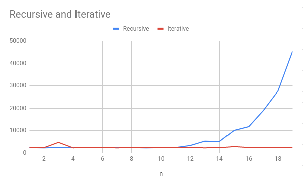

# Practical 3: Recursion

### Warm-up questions
1. What are the two principal characteristics of a recursive algorithm?

   **Base case and a recursive case**

2. Recursion is:
    1. theoretically interesting but rarely used in actual programs
    2. theoretically uninteresting and rarely used in programs
    3. **theoretically powerful and often used in algorithms that could benefit from recursive methods**

3. All recursive functions can be implemented iteratively:
**True**

4. If a recursive algorithm does NOT have a base case, the compiler will detect this and throw a compile error?
**False**

5. A recursive function must have a void return type:
**False**

6. Recursive calls are usually contained within a loop:
**False**

7. Infinite recursion can occur when a recursive algorithm does not contain a base case:
**True**

8. Which of these statements is true about the following code?
```java
int mystery(int n)
{
    if (n>0) return n + mystery(n-1);
    return 0;
}
```


- The base case for this recursive method is an argument with any value which is greater than zero.
- **The base case for this recursive function is an argument with the value zero.**
- There is no base case.


9: List common bugs associated with recursion?
- No base case.
- Not all recursive cases tend towards base case.
- Assuming recursive call has no memory overhead.
- Too many recursive calls lead to stack overflow.

10: What method can be used to address recursive algorithms that excessively recompute?
**Memoization**


### Fibonacci

Exercises
Below is an iterative algorithm that computes Fibonacci numbers. Write a recursive function to do the same.

```java
class Fib {
    static int fibonacciRecursive(int n){
       if (n <= 1) {
           return 1;
       } else {
           return fibonacciRecursive(n-1) + fibonacciRecursive(n-2);
       }
    }

    static int fibonacciIterative(int n) {
        if (n<=1)
            return 1;

        int fib = 1;
        int prevFib =  1;

        for (int i = 2; i <= n; i++) {
            int temp = fib;
            fib = fib + prevFib;
            prevFib = temp;
        }
        return fib;
    }

    public static void main(String[] args) {
        int n = 9;
        System.out.println(fibonacciIterative(n));
    }
}
```

| n  | Recursive | Iterative |
|----|-----------|-----------|
| 1  | 2375      | 2444      |
| 2  | 2305      | 2375      |
| 3  | 2444      | 4749      |
| 4  | 2375      | 2305      |
| 5  | 2375      | 2445      |
| 6  | 2375      | 2375      |
| 7  | 2374      | 2305      |
| 8  | 2374      | 2374      |
| 9  | 2305      | 2374      |
| 10 | 2375      | 2375      |
| 11 | 2444      | 2374      |
| 12 | 3352      | 2374      |
| 13 | 5308      | 2305      |
| 14 | 5168      | 2374      |
| 15 | 10127     | 2864      |
| 16 | 11803     | 2444      |
| 17 | 18996     | 2444      |
| 18 | 27657     | 2444      |
| 19 | 45326     | 2444      |



### Tower of Hanoi

Code for Tower of Hanoi is in
[ie.davidloftus.algorithms.Recursion](../src/main/java/ie/davidloftus/algorithms/Recursion.java)
