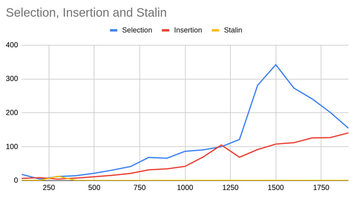

# Practical 4: Elementary Sorting

### Quick Questions

1. **How many compares does insertion sort make on an input array that is already sorted?**
Linear

2. **What is a stable sorting algorithm?**
An algorithm that retains the existing order of elements with equal keys.

3. **What is an external sorting algorithm?**
Algorithm that uses tape or disk during the sort

4. **Identify 6 ways of classifying sorting algorithms?**
    1. Stable/Not Stable
    2. External/Internal
    3. In place
    4. Time complexity
    5. Comparison vs Non-comparison
    6. Recursive vs Non recursive

### Algorithmic Development

Sorting code can be found in
[ie.davidloftus.algorithms.sorting](../src/main/java/ie/davidloftus/algorithms/sorting)

Here's the performance sorting arrays with different lengths.

| n    | Selection | Insertion | Stalin   |
|------|-----------|-----------|----------|
| 0    | 6.806613  | 8.16391   | 0.54072  |
| 100  | 6.021974  | 6.385284  | 0.548569 |
| 200  | 0.853682  | 0.176165  | 0.611391 |
| 300  | 5.283505  | 0.065044  | 0.131079 |
| 400  | 0.826575  | 0.057466  | 0.148931 |
| 500  | 0.85132   | 0.039948  | 0.14886  |
| 600  | 0.810585  | 0.07348   | 0.138115 |
| 700  | 0.848497  | 0.038149  | 0.133408 |
| 800  | 0.78638   | 0.036884  | 0.125317 |
| 900  | 0.793208  | 0.033277  | 0.102213 |
| 1000 | 0.805447  | 0.039951  | 0.176552 |
| 1100 | 0.864608  | 0.034168  | 0.184965 |
| 1200 | 0.818529  | 0.039757  | 0.158622 |
| 1300 | 0.715822  | 0.035846  | 0.038137 |
| 1400 | 0.834084  | 0.044783  | 0.016889 |
| 1500 | 0.808107  | 0.041897  | 0.018045 |
| 1600 | 0.853451  | 0.039171  | 0.016066 |
| 1700 | 0.812961  | 0.042158  | 0.015906 |
| 1800 | 0.770436  | 0.04123   | 0.015248 |
| 1900 | 0.805104  | 0.043976  | 0.016581 |

As you can see Stalin sort is clearly the most optimal sorting algorithm and anyone who says otherwise shall be sent
 to the gulag.

