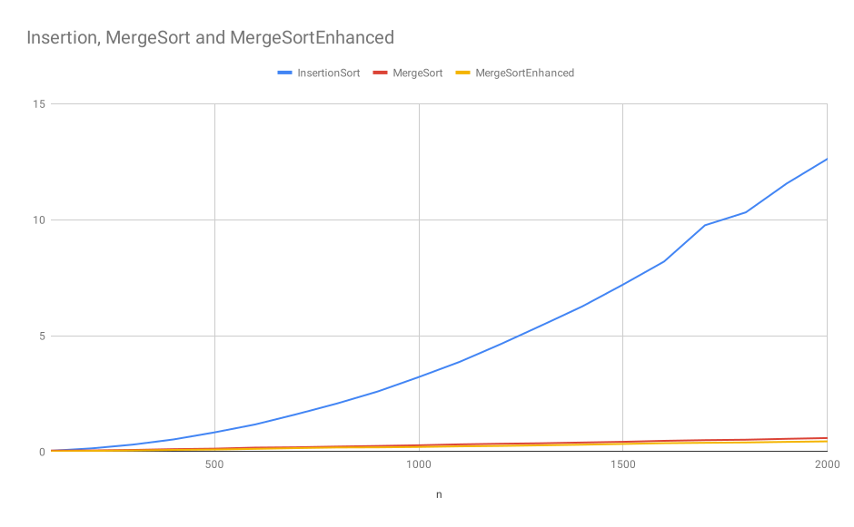

# Practical 5: Advanced Sorting Algorithms

### Quick Questions

1. Mergesort guarantees to sort an array in **Linearithmic time**, regardless of the input:

2. The main disadvantage of MergeSort is:
**It uses extra space in proportion to the size of the input**

3. Merge sort makes use of which common algorithm strategy?
**Divide and conquer**

4. Which sorting algorithm will take the least time when all elements of the input array are identical?
**Bogo Sort**

5. Which sorting algorithm should you use when the order of input is not known?
**Mergesort**

### Algorithmic Development

##### Part 1 

Implementation of Merge Sort can be found in
[ie.davidloftus.algorithms.sorting.MergeSort](../src/main/java/ie/davidloftus/algorithms/sorting/MergeSort.java)

##### Part 2

1. The merge sort algorithm now uses insertion sort once the array is small enough.

2. We also optimize merging arrays when all values in left are less than values in right.

I added the improvements to
[MergeSortEnhanced](../src/main/java/ie/davidloftus/algorithms/sorting/MergeSortEnhanced.java)

##### Part 3

|    n |       SelectionSort |       InsertionSort |          StalinSort |           MergeSort |   MergeSortEnhanced |
|------|---------------------|---------------------|---------------------|---------------------|---------------------|
|  100 |            0.015269 |            0.028463 |            0.005007 |            0.087889 |            0.021585 |
|  200 |            0.048962 |            0.079354 |            0.008428 |            0.053957 |            0.041252 |
|  300 |            0.100679 |            0.168502 |            0.014543 |            0.085212 |            0.054974 |
|  400 |            0.172575 |            0.289328 |            0.022932 |            0.116534 |            0.085010 |
|  500 |            0.269196 |            0.450306 |            0.032474 |            0.147820 |            0.108415 |
|  600 |            0.376273 |            0.643397 |            0.043794 |            0.201839 |            0.119496 |
|  700 |            0.508286 |            0.868633 |            0.056735 |            0.208790 |            0.162316 |
|  800 |            0.668701 |            1.122549 |            0.071850 |            0.249418 |            0.186296 |
|  900 |            0.827670 |            1.421918 |            0.087874 |            0.280959 |            0.208875 |
| 1000 |            1.022029 |            1.824893 |            0.106759 |            0.313953 |            0.232886 |
| 1100 |            1.338331 |            2.168784 |            0.124817 |            0.346134 |            0.256427 |
| 1200 |            1.460547 |            2.529103 |            0.144731 |            0.379677 |            0.274892 |
| 1300 |            1.725292 |            3.125131 |            0.165638 |            0.420238 |            0.300174 |
| 1400 |            1.969048 |            3.433071 |            0.190483 |            0.447664 |            0.336914 |
| 1500 |            2.265707 |            3.939768 |            0.213519 |            0.486174 |            0.374260 |
| 1600 |            2.569919 |            4.450857 |            0.245712 |            0.527617 |            0.394859 |
| 1700 |            2.915017 |            5.024716 |            0.269230 |            0.556278 |            0.420686 |
| 1800 |            3.231421 |            5.614927 |            0.297899 |            0.582303 |            0.440895 |
| 1900 |            3.597963 |            6.241840 |            0.331323 |            0.640145 |            0.472608 |
| 2000 |            4.009848 |            6.929654 |            0.365402 |            0.681512 |            0.507593 |

