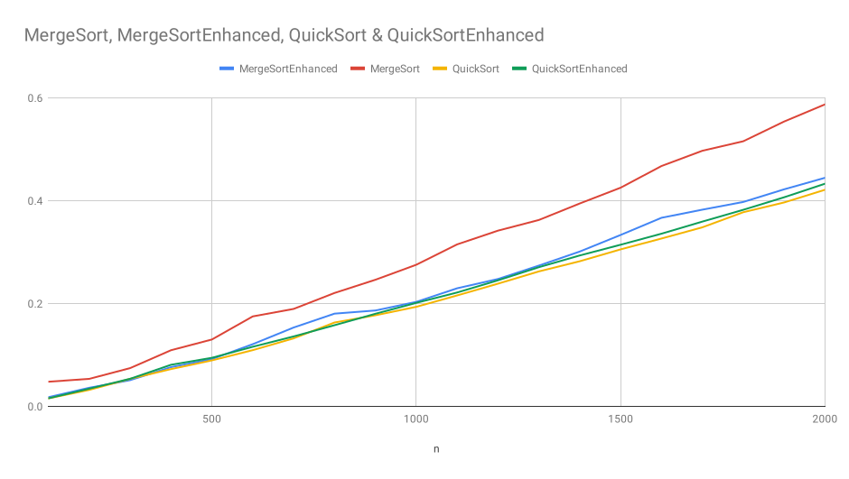

# Practical 6: Advanced Sorting Algorithms Part II (Quicksort)

### Initial Implementation

The first implementation can be found in
[ie.davidloftus.algorithms.sorting.QuickSort](../src/main/java/ie/davidloftus/algorithms/sorting/QuickSort.java)

### Improvements

1. Similar to the improvements in MergeSort, I had the improved quicksort use insertion sort for small arrays.

2. Since QuickSort performs best on an unordered list, we intentionally shuffle the array to avoid worst case
 performance.
 
3. We chose our pivot to be the middle element. This improves performance when the array is already sorted (but it is
 kinda useless given the 2nd optimization).

The improved implementation can be found in
[ie.davidloftus.algorithms.sorting.EnhancedQuickSort](../src/main/java/ie/davidloftus/algorithms/sorting/QuickSortEnhanced.java)

### Performance Analysis

|    n |       SelectionSort |       InsertionSort |          StalinSort |           MergeSort |   MergeSortEnhanced |           QuickSort |   EnhancedQuickSort |
|------|---------------------|---------------------|---------------------|---------------------|---------------------|---------------------|---------------------|
|  100 |            0.018155 |            0.037085 |            0.004954 |            0.047858 |            0.017803 |            0.015491 |            0.015531 |
|  200 |            0.051799 |            0.142644 |            0.008900 |            0.053462 |            0.036114 |            0.031975 |            0.034376 |
|  300 |            0.106118 |            0.303689 |            0.015091 |            0.074363 |            0.050907 |            0.053514 |            0.053606 |
|  400 |            0.180873 |            0.527351 |            0.023011 |            0.109134 |            0.076270 |            0.072448 |            0.080818 |
|  500 |            0.271761 |            0.831191 |            0.032978 |            0.129981 |            0.091874 |            0.089354 |            0.094414 |
|  600 |            0.388206 |            1.174588 |            0.048997 |            0.174900 |            0.120910 |            0.109280 |            0.115868 |
|  700 |            0.531765 |            1.611261 |            0.057792 |            0.189474 |            0.153300 |            0.132251 |            0.135966 |
|  800 |            0.678158 |            2.076742 |            0.072773 |            0.220467 |            0.180287 |            0.163051 |            0.157795 |
|  900 |            0.907627 |            2.597525 |            0.088196 |            0.246181 |            0.186393 |            0.177064 |            0.180021 |
| 1000 |            1.074689 |            3.217422 |            0.106215 |            0.275342 |            0.203181 |            0.193522 |            0.201249 |
| 1100 |            1.272068 |            3.872544 |            0.126751 |            0.314968 |            0.229600 |            0.215676 |            0.221400 |
| 1200 |            1.532953 |            4.633352 |            0.146386 |            0.341732 |            0.247684 |            0.238593 |            0.245124 |
| 1300 |            1.798932 |            5.440668 |            0.167945 |            0.362447 |            0.273745 |            0.262422 |            0.270631 |
| 1400 |            2.046907 |            6.262425 |            0.191419 |            0.394547 |            0.301055 |            0.282181 |            0.293436 |
| 1500 |            2.356021 |            7.206770 |            0.215858 |            0.425260 |            0.333327 |            0.305290 |            0.314317 |
| 1600 |            2.670764 |            8.195652 |            0.242722 |            0.467405 |            0.366732 |            0.326391 |            0.335801 |
| 1700 |            3.016061 |            9.758078 |            0.268898 |            0.497085 |            0.382506 |            0.348189 |            0.359322 |
| 1800 |            3.400337 |           10.315834 |            0.302480 |            0.515536 |            0.397487 |            0.377515 |            0.382237 |
| 1900 |            3.801864 |           11.560078 |            0.330621 |            0.553922 |            0.422071 |            0.396524 |            0.406620 |
| 2000 |            4.154834 |           12.623683 |            0.366464 |            0.587298 |            0.444487 |            0.421205 |            0.433008 |

