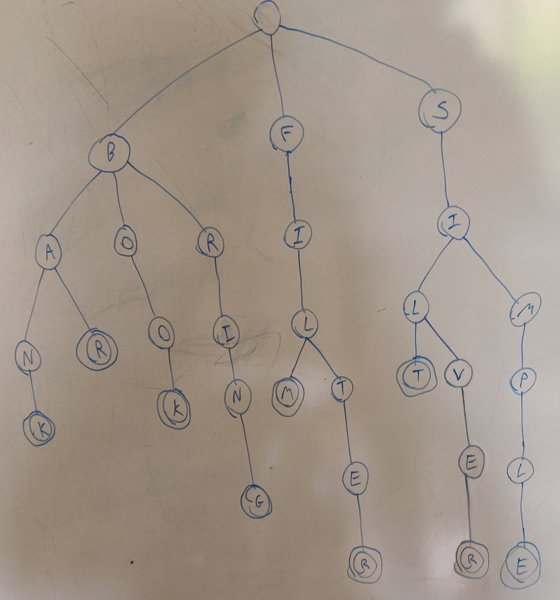

# Practical 8: Tries

### Drawing a Trie by hand

Here's a hand drawn Trie for the set of words {bank, book, bar, bring, film, filter, simple, silt, silver}.
End of words is denoted using a double cicle.

### Trie implementation

Trie code can be found in [Trie.java](../src/main/java/ie/davidloftus/algorithms/Trie.java)

Alot of optimizations have been made to reduce memory usage of this data structure.